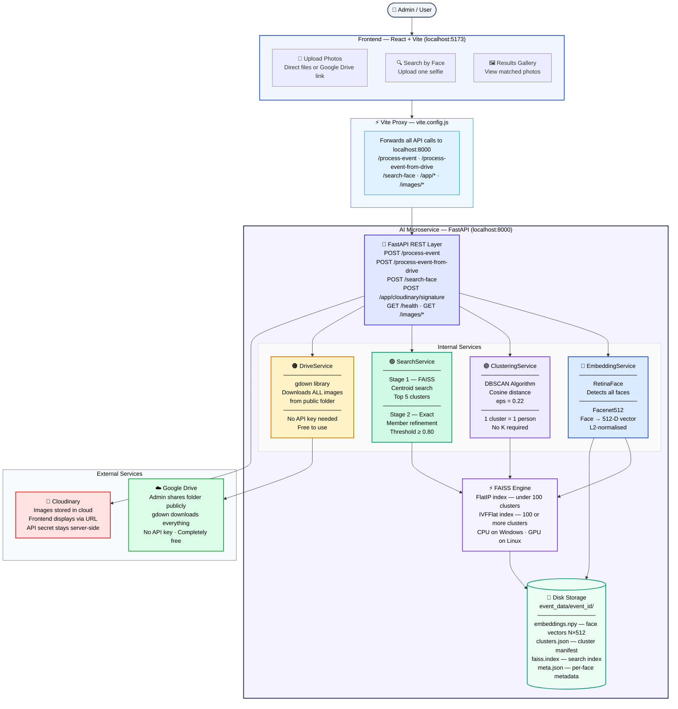

# 🎯 SmartFace — AI-Powered Face Retrieval System

> **Find every photo of a person from any event — just upload their face.**

A full-stack AI application combining a React frontend, Python AI microservice, and Cloudinary for image storage. Upload event photos via Google Drive or directly, then let anyone find all their photos by uploading a single selfie.

✅ **Tested & Working** — Processes Google Drive folders, clusters faces with 96%+ similarity scores, and returns matched photos in real time.

---

## 📋 Table of Contents

1. [What This Does](#what-this-does)
2. [Full System Architecture](#full-system-architecture)
3. [Tech Stack](#tech-stack)
4. [How It Works — Flow](#how-it-works--flow)
5. [Project Structure](#project-structure)
6. [Setup & Installation](#setup--installation)
7. [Running the App](#running-the-app)
8. [API Reference](#api-reference)
9. [Storage Structure](#storage-structure)
10. [Tuning Guide](#tuning-guide)
11. [Common Errors & Fixes](#common-errors--fixes)

---

## 🧠 What This Does

### The Problem
After a wedding, concert, or corporate event — thousands of photos are taken.
Finding YOUR photos means manually browsing every single image. It takes hours
and most guests never receive their photos.

### The Solution

```
Admin uploads event photos via Google Drive or direct upload
                        ↓
AI detects every face → generates embeddings → clusters by person
                        ↓
User uploads one selfie → AI finds their cluster → returns all their photos
```

---

## 🏗️ Full System Architecture



### End-to-End Flow


## 🛠️ Tech Stack

### Frontend
| Technology | Purpose |
|---|---|
| React + Vite | UI framework, fast dev server |
| Vite Proxy | Forwards API calls to AI microservice |
| Cloudinary SDK | Upload images to cloud storage |

### AI Microservice
| Technology | Purpose |
|---|---|
| FastAPI | REST API, async, auto Swagger docs |
| RetinaFace (DeepFace) | State-of-the-art face detection |
| Facenet512 (DeepFace) | 512-dim face embedding vectors |
| DBSCAN (scikit-learn) | Cluster faces by person, no K needed |
| FAISS CPU | Fast vector similarity search |
| gdown | Download Google Drive folders |
| OpenCV | Image decode and processing |
| Uvicorn | ASGI production server |

### Storage & Cloud
| Technology | Purpose |
|---|---|
| NumPy (.npy) | Store face embedding vectors on disk |
| JSON | Store cluster manifests on disk |
| Cloudinary | Host event images in the cloud |
| Google Drive | Bulk import event photos via link |

---

## 🔄 How It Works — Flow

### Admin Pipeline

```
ADMIN                    FRONTEND              AI MICROSERVICE
  │                          │                       │
  │── Paste Drive link ──────►│                       │
  │                          │── POST /process- ─────►│
  │                          │   event-from-drive     │
  │                          │                       │── gdown downloads
  │                          │                       │   all images
  │                          │                       │
  │                          │                       │── RetinaFace detects
  │                          │                       │   ALL faces
  │                          │                       │
  │                          │                       │── Facenet512 converts
  │                          │                       │   each face → 512-D vector
  │                          │                       │
  │                          │                       │── DBSCAN clusters vectors
  │                          │                       │   Cluster 0 = Alice
  │                          │                       │   Cluster 1 = Bob ...
  │                          │                       │
  │                          │                       │── FAISS index built
  │                          │                       │   and saved to disk
  │                          │                       │
  │                          │◄── clusters response ─│
  │◄── Event indexed ────────│                       │
```

### User Search Pipeline

```
USER                     FRONTEND              AI MICROSERVICE
  │                          │                       │
  │── Upload selfie ─────────►│                       │
  │                          │── POST /search-face ──►│
  │                          │                       │── RetinaFace + Facenet512
  │                          │                       │   → query 512-D vector
  │                          │                       │
  │                          │                       │── STAGE 1: FAISS search
  │                          │                       │   → Top-5 clusters
  │                          │                       │
  │                          │                       │── STAGE 2: Exact match
  │                          │                       │   vs all member embeddings
  │                          │                       │
  │                          │                       │── similarity ≥ 0.80?
  │                          │                       │   YES → Match found ✅
  │                          │                       │
  │                          │◄── matched_images ────│
  │◄── All your photos ──────│                       │
```

---

## 📁 Project Structure

```
Smarter_Face_Retrieval_System/
│
├── frontend/                      # React + Vite frontend
│   ├── src/
│   │   ├── components/            # UI components
│   │   ├── lib/
│   │   │   └── api.js             # API call functions
│   │   └── main.jsx               # App entry point
│   ├── vite.config.js             # Vite + proxy config ← IMPORTANT
│   ├── package.json
│   └── .env                       # Frontend environment vars
│
├── api/                           # FastAPI routes (HTTP layer only)
│   └── routes/
│       ├── events.py              # POST /process-event
│       ├── embedding.py           # POST /get-embedding
│       ├── search.py              # POST /search-face
│       └── drive.py               # POST /process-event-from-drive
│
├── services/                      # All AI business logic
│   ├── embedding_service.py       # RetinaFace + Facenet512
│   ├── clustering_service.py      # DBSCAN + manifest builder
│   ├── event_service.py           # Full pipeline orchestrator
│   ├── search_service.py          # Two-stage FAISS search
│   └── drive_service.py           # Google Drive downloader
│
├── utils/                         # Shared helpers
│   ├── faiss_engine.py            # FAISS index build/save/load
│   ├── image_utils.py             # Decode, save images
│   ├── storage.py                 # Disk read/write
│   └── logger.py                  # Logging setup
│
├── tests/
│   └── test_service.py            # Pytest unit + integration tests
│
├── event_data/                    # Auto-created runtime data
│   └── <event_id>/
│       ├── images/                # Downloaded/uploaded photos
│       ├── embeddings.npy         # Face vectors (N × 512 float32)
│       ├── meta.json              # Per-face metadata
│       ├── clusters.json          # Cluster manifest
│       └── faiss.index            # FAISS search index
│
├── main.py                        # FastAPI app + Cloudinary signature
├── config.py                      # All settings via pydantic-settings
├── requirements.txt               # Python dependencies
├── .env                           # Environment config (never commit)
├── .env.example                   # Template with all settings
├── Dockerfile                     # Container image
├── docker-compose.yml             # Orchestration
└── .gitignore                     # Excludes event_data, .venv, .env
```

---

## ⚙️ Setup & Installation

### Prerequisites
- Python 3.10+
- Node.js 18+
- pip
- npm

### Step 1 — Create Python virtual environment

```powershell
python -m venv .venv
.venv\Scripts\Activate.ps1

# If execution policy error:
Set-ExecutionPolicy RemoteSigned -Scope CurrentUser
.venv\Scripts\Activate.ps1
```

### Step 2 — Install Python dependencies

```powershell
pip install -r requirements.txt
pip install faiss-cpu gdown
```

### Step 3 — Create .env file

```powershell
Copy-Item .env.example .env
```

### Step 4 — Fill in .env with real values

```env
# DBSCAN — controls face grouping strictness
DBSCAN_EPS=0.22
SIMILARITY_THRESHOLD=0.80

# FAISS
USE_FAISS=true
FAISS_DEVICE=cpu

# Cloudinary — get from cloudinary.com/console
CLOUDINARY_CLOUD_NAME=your_cloud_name
CLOUDINARY_API_KEY=your_api_key
CLOUDINARY_API_SECRET=your_api_secret
CLOUDINARY_UPLOAD_FOLDER=face-retrieval
```

### Step 5 — Install frontend dependencies

```powershell
cd frontend
npm install
cd ..
```

### Step 6 — Verify vite.config.js has all routes proxied

Open `frontend/vite.config.js` — it must look like this:

```javascript
import { defineConfig } from "vite";
import react from "@vitejs/plugin-react";

export default defineConfig({
  plugins: [react()],
  server: {
    port: 5173,
    proxy: {
      "/app": "http://127.0.0.1:8000",
      "/health": "http://127.0.0.1:8000",
      "/process-event": "http://127.0.0.1:8000",
      "/process-event-from-drive": "http://127.0.0.1:8000",
      "/search-face": "http://127.0.0.1:8000",
      "/get-embedding": "http://127.0.0.1:8000",
      "/recluster-event": "http://127.0.0.1:8000",
      "/event": "http://127.0.0.1:8000",
      "/images": "http://127.0.0.1:8000",
    }
  }
});
```

---

## 🚀 Running the App

You need **two terminals open at the same time**.

### Terminal 1 — AI Microservice

```powershell
.venv\Scripts\Activate.ps1
uvicorn main:app --host 0.0.0.0 --port 8000
```

Wait for:
```
INFO | Embedding model warmed up successfully.
INFO | Application startup complete.
INFO | Uvicorn running on http://0.0.0.0:8000
```

### Terminal 2 — Frontend

```powershell
cd frontend
npm run dev
```

Wait for:
```
VITE ready in 285ms
Local: http://localhost:5173/
```

### Access the app

| URL | Description |
|---|---|
| `http://localhost:5173` | Main frontend app |
| `http://127.0.0.1:8000/health` | AI service health check |
| `http://127.0.0.1:8000/docs` | Swagger UI — all API endpoints |

---

## 📡 API Reference

### POST /process-event
Upload images directly → detect → embed → cluster → index.

**Body (form-data)**
```
event_id   Text    wedding2024
images     File    photo1.jpg, photo2.jpg ...
```

### POST /process-event-from-drive
Import from public Google Drive folder automatically.

**Body (form-data)**
```
event_id     Text    wedding2024
drive_link   Text    https://drive.google.com/drive/folders/YOUR_ID
```

> Drive folder must be: Share → Anyone with the link → Viewer

### POST /search-face
Upload selfie → find all photos of that person.

**Body (form-data)**
```
event_id   Text    wedding2024
image      File    selfie.jpg
```

**Response**
```json
{
  "matched_cluster_id": 34,
  "similarity": 0.969415,
  "matched_images": ["event_data/event/images/photo1.jpg"],
  "search_device": "cpu",
  "message": "Match found."
}
```

### POST /app/cloudinary/signature
Returns a signed Cloudinary upload signature for the frontend.
Called automatically by the frontend before uploading images.

### POST /recluster-event
Re-run DBSCAN on existing data — no re-upload needed.

**Body (form-data)**
```
event_id   Text    wedding2024
eps        Text    0.18
```

### GET /health
```json
{
  "status": "ok",
  "faiss": { "faiss_installed": true, "resolved_device": "cpu" }
}
```

---

## 🗄️ Storage Structure

```
event_data/
└── annual-meetup/
    ├── images/            ← original photos saved here
    ├── embeddings.npy     ← VECTOR STORE: (N, 512) float32
    ├── meta.json          ← [{image_path, face_index, cluster_id}]
    ├── clusters.json      ← {cluster_id, centroid, image_paths}
    └── faiss.index        ← FAISS search index
```

**`embeddings.npy`** is your vector database — one 512-dimensional row per detected face.

---

## 🎛️ Tuning Guide

### DBSCAN eps — controls grouping strictness

| eps | Behaviour | Use when |
|---|---|---|
| 0.35 | Loose — may merge similar people | Testing only |
| 0.28 | Medium | General use |
| 0.22 | Strict — good accuracy ✅ | Recommended |
| 0.18 | Very strict | Look-alikes / twins |

**Wrong photos returned?** Lower eps, then call:
```
POST /recluster-event  →  event_id + eps=0.18
```
No need to re-upload images.

### Similarity Threshold

| Threshold | Behaviour |
|---|---|
| 0.55 | Loose — may return wrong people |
| 0.75 | Balanced |
| 0.80 | Strict — recommended ✅ |
| 0.90 | Very strict — may miss some |

### Detector Speed vs Accuracy

| Detector | Speed | Accuracy | Use for |
|---|---|---|---|
| `retinaface` | Slow | Best | Production ✅ |
| `mtcnn` | Medium | Good | Balance |
| `opencv` | Fast | OK | Quick testing |

Change in `.env`: `DETECTOR_BACKEND=opencv`

---

## 🚨 Common Errors & Fixes

| Error | Cause | Fix |
|---|---|---|
| `Upload blocked - Request failed` | Frontend proxy missing route | Add route to `vite.config.js` proxy |
| `ECONNREFUSED` | AI server not running | Run `uvicorn main:app --port 8000` |
| `404` on `/process-event-from-drive` | Route not in Vite proxy | Add to `vite.config.js` |
| `Upload blocked - Cloudinary invalid` | Wrong Cloudinary credentials | Check `.env` cloud name/key/secret |
| `422 Unprocessable Entity` | Wrong body type in Postman | Switch to `form-data` |
| `No face detected` | Blurry/small face | Use clear front-facing photo |
| `faiss-gpu not found` | Windows limitation | Use `faiss-cpu` instead |
| `gdown error` | Not installed | `pip install gdown` |
| Drive folder error | Folder not public | Share → Anyone with link → Viewer |
| Wrong photos returned | eps too loose | Lower eps, call `/recluster-event` |
| Model downloading on first run | First-time setup | Wait 5–10 mins, happens once only |
| Both servers must run | Missing terminal | Open 2 terminals: uvicorn + npm |

---

## 🌐 How Frontend and Backend Connect

```
Frontend (port 5173)
        │
        │ All API calls use relative URLs like /search-face
        │
        ▼
Vite Proxy (vite.config.js)
        │
        │ Sees /search-face → forwards to http://127.0.0.1:8000/search-face
        │
        ▼
AI Microservice (port 8000)
        │
        │ Processes request, returns response
        │
        ▼
Frontend displays results
```

**Key rule:** Every API route used by the frontend MUST be listed in `vite.config.js` proxy. If you add a new route to the AI service, add it to the proxy too.

---

## 👨‍💻 Developer Notes

- **No model training** — only pre-trained models (RetinaFace + Facenet512)
- **Incremental uploads** — same `event_id` appends and re-clusters automatically
- **Duplicate detection** — same image re-uploaded is skipped (similarity > 0.98)
- **Noise handling** — DBSCAN noise points become singleton clusters, no image lost
- **Two-stage search** — FAISS for speed + exact member match for accuracy
- **Windows compatible** — `faiss-cpu` works perfectly, GPU available on Linux
- **Google Drive** — `gdown` handles public folders, no API key needed
- **Cloudinary signature** — generated server-side, API secret never exposed to browser